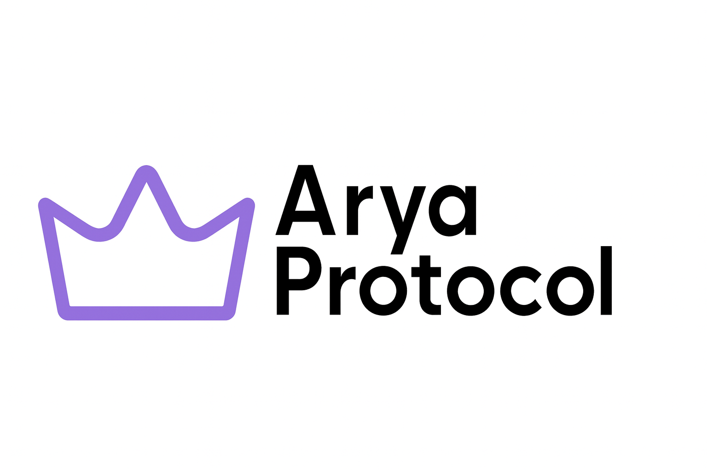

# What is Arya?

<figure><figcaption></figcaption></figure>

Arya is a money market abstraction infrastrcuture protocol designed to optimize and simplify how users interact with lending and borrowing platforms. It acts as a **unified aggregator and optimizer** that allows users to deposit or borrow assets without manually researching across multiple protocols like Aave, Compound, or Morpho.

***

### Vision

Arya envisions a open market where capital efficiency, risk management, and accessibility are core components. By offering smart routing, real-time rebalancing, and integrated protocol access, Arya makes DeFi lending and borrowing intuitive, profitable, and safe for all user types.

***

### Problem Space

The current DeFi ecosystem is fragmented. Users are forced to:

* Compare multiple protocols manually for rates.
* Manage positions across different UIs.
* Miss yield opportunities due to static deposits.
* Face inefficient capital usage when borrowing.

Arya solves this with **automation, intelligence, and composability**.

###
